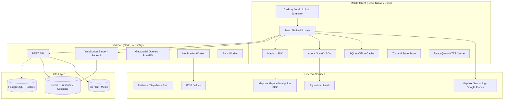

# CONVOY App — Technical Design Document

## Overview

CONVOY is a real-time group navigation and communication platform for car enthusiasts. The system consists of a React Native / Expo mobile app (iOS + Android), native CarPlay and Android Auto extensions, a Node.js / Fastify REST API, a WebSocket layer for real-time events, a PostgreSQL + PostGIS database, and supporting cloud infrastructure for media, push notifications, and voice.

### Design Goals

- Driving-first: all critical interactions reachable in ≤ 2 taps; CarPlay / Android Auto surfaces must work without phone interaction.
- Offline-resilient: navigation, group awareness, and hazard data must survive total connectivity loss using on-device caches.
- Real-time at scale: location updates, PTT signaling, and group events must propagate to all Members within 3 seconds.
- Privacy-by-default: dropped pins stay on-device; raw search queries go only to the geocoding provider; PTT audio is never persisted.

---

## Architecture

### High-Level System Diagram



### Deployment Topology

| Service | Runtime | Notes |
|---|---|---|
| REST API | Node.js 20 / Fastify | Horizontally scalable; stateless |
| WebSocket | Socket.io on Node.js | Sticky sessions via Redis adapter |
| Database | PostgreSQL 16 + PostGIS 3 | Primary + read replica |
| Cache / Presence | Redis 7 | Ephemeral location and session state |
| Object Storage | AWS S3 or Cloudflare R2 | Avatars, drive summary cards, tile manifests |
| Push Worker | BullMQ on Node.js | FCM + APNs delivery with retry |
| Sync Worker | BullMQ on Node.js | Processes offline queues on reconnect |

---

## Components and Interfaces

### Mobile Client

#### Navigation Stack

- **RootNavigator** — handles auth gate, deep links, and CarPlay/Auto session hand-off.
- **MapScreen** — primary driving screen: Map_View, PTT button, Report button, SOS button, Driving Mode overlay.
- **ConvoyScreen** — group management, Member list, Rally Point controls.
- **ProfileScreen** — user profile, Garage, Drive History, Friends.
- **SettingsScreen** — all user-configurable preferences.

#### Core Services (client-side)

| Service | Responsibility |
|---|---|
| `LocationService` | Reads GPS via Expo Location; throttles to 3 s intervals; writes to Zustand and queues WebSocket emit. |
| `OfflineCacheService` | Manages Expo SQLite for hazard queue, pending Drive_History, and last-known Member positions. |
| `SyncService` | Monitors `NetInfo`; on reconnect drains the SQLite queue and calls REST API bulk endpoints. |
| `NotificationService` | Registers FCM/APNs token; handles foreground banners; routes taps to correct screen. |
| `PTTService` | Wraps Agora/LiveKit SDK; manages channel join/leave, transmit state, ducking, mute state. |
| `HazardService` | Submit, confirm, dismiss hazard reports; proximity alert computation. |
| `DrivingModeService` | Monitors Bluetooth and CarPlay connection events; toggles Driving Mode UI. |
| `AuthService` | Wraps Firebase/Supabase Auth SDK; manages token refresh; exposes `useAuth` hook. |

#### State Management

- **Zustand** stores: `authStore`, `convoySore`, `locationStore`, `hazardStore`, `pttStore`, `settingsStore`.
- **React Query** for all REST fetches (Drive History, profile, friends, search results, places).
- Zustand stores are persisted to `AsyncStorage` for settings and `SQLite` for offline-critical data.

### Backend

#### REST API (Fastify)

Routes are prefixed `/api/v1`. All routes except auth endpoints require a `Bearer` JWT.

#### WebSocket Server (Socket.io)

Rooms map 1:1 with `convoy_group_id`. The Redis adapter ensures events fan out across all server instances.

#### Notification Worker

BullMQ job queue. Each job carries `{ userId, type, payload }`. Worker resolves FCM/APNs tokens from the database and calls the appropriate push gateway.

#### Geospatial Query Layer

PostGIS is used for:
- Proximity hazard lookups (`ST_DWithin`).
- Convoy gap calculations (distance between Member coordinates).
- Fuel station radius queries forwarded through the places API.

---

## Data Models

### `users`

```sql
CREATE TABLE users (
  id            UUID PRIMARY KEY DEFAULT gen_random_uuid(),
  display_name  TEXT NOT NULL,
  phone_number  TEXT UNIQUE,
  email         TEXT UNIQUE,
  avatar_url    TEXT,
  ptt_callsign  TEXT,
  privacy       TEXT NOT NULL DEFAULT 'open' CHECK (privacy IN ('open', 'invite_only')),
  created_at    TIMESTAMPTZ NOT NULL DEFAULT now(),
  updated_at    TIMESTAMPTZ NOT NULL DEFAULT now()
);
```

### `auth_providers`

```sql
CREATE TABLE auth_providers (
  id          UUID PRIMARY KEY DEFAULT gen_random_uuid(),
  user_id     UUID NOT NULL REFERENCES users(id) ON DELETE CASCADE,
  provider    TEXT NOT NULL CHECK (provider IN ('phone', 'email', 'apple', 'google')),
  provider_id TEXT NOT NULL,
  UNIQUE (provider, provider_id)
);
```

### `devices`

```sql
CREATE TABLE devices (
  id         UUID PRIMARY KEY DEFAULT gen_random_uuid(),
  user_id    UUID NOT NULL REFERENCES users(id) ON DELETE CASCADE,
  push_token TEXT NOT NULL,
  platform   TEXT NOT NULL CHECK (platform IN ('ios', 'android')),
  updated_at TIMESTAMPTZ NOT NULL DEFAULT now()
);
```

### `vehicles` (Garage)

```sql
CREATE TABLE vehicles (
  id         UUID PRIMARY KEY DEFAULT gen_random_uuid(),
  user_id    UUID NOT NULL REFERENCES users(id) ON DELETE CASCADE,
  year       SMALLINT,
  make       TEXT,
  model      TEXT,
  color      TEXT,
  photo_url  TEXT,
  is_active  BOOLEAN NOT NULL DEFAULT false,
  created_at TIMESTAMPTZ NOT NULL DEFAULT now()
);
```

### `friendships`

```sql
CREATE TABLE friendships (
  id           UUID PRIMARY KEY DEFAULT gen_random_uuid(),
  requester_id UUID NOT NULL REFERENCES users(id) ON DELETE CASCADE,
  addressee_id UUID NOT NULL REFERENCES users(id) ON DELETE CASCADE,
  status       TEXT NOT NULL DEFAULT 'pending' CHECK (status IN ('pending', 'accepted', 'blocked')),
  created_at   TIMESTAMPTZ NOT NULL DEFAULT now(),
  UNIQUE (requester_id, addressee_id)
);
```

### `convoy_groups`

```sql
CREATE TABLE convoy_groups (
  id              UUID PRIMARY KEY DEFAULT gen_random_uuid(),
  name            TEXT NOT NULL,
  join_code       CHAR(6) NOT NULL UNIQUE,
  admin_id        UUID NOT NULL REFERENCES users(id),
  access_type     TEXT NOT NULL DEFAULT 'open' CHECK (access_type IN ('open', 'invite_only')),
  status          TEXT NOT NULL DEFAULT 'active' CHECK (status IN ('active', 'ended')),
  gap_threshold_m INTEGER NOT NULL DEFAULT 3219, -- 2 miles in metres
  ptt_max_seconds SMALLINT NOT NULL DEFAULT 30,
  created_at      TIMESTAMPTZ NOT NULL DEFAULT now(),
  ended_at        TIMESTAMPTZ
);
```

### `convoy_members`

```sql
CREATE TABLE convoy_members (
  id         UUID PRIMARY KEY DEFAULT gen_random_uuid(),
  group_id   UUID NOT NULL REFERENCES convoy_groups(id) ON DELETE CASCADE,
  user_id    UUID NOT NULL REFERENCES users(id) ON DELETE CASCADE,
  joined_at  TIMESTAMPTZ NOT NULL DEFAULT now(),
  left_at    TIMESTAMPTZ,
  is_muted   BOOLEAN NOT NULL DEFAULT false,
  UNIQUE (group_id, user_id)
);
```

### `ptt_channels`

```sql
CREATE TABLE ptt_channels (
  id       UUID PRIMARY KEY DEFAULT gen_random_uuid(),
  group_id UUID NOT NULL REFERENCES convoy_groups(id) ON DELETE CASCADE,
  name     TEXT NOT NULL,
  is_all   BOOLEAN NOT NULL DEFAULT false,
  UNIQUE (group_id, name)
);
```

### `ptt_channel_members`

```sql
CREATE TABLE ptt_channel_members (
  channel_id UUID NOT NULL REFERENCES ptt_channels(id) ON DELETE CASCADE,
  user_id    UUID NOT NULL REFERENCES users(id) ON DELETE CASCADE,
  PRIMARY KEY (channel_id, user_id)
);
```

### `ptt_log`

```sql
CREATE TABLE ptt_log (
  id          UUID PRIMARY KEY DEFAULT gen_random_uuid(),
  group_id    UUID NOT NULL REFERENCES convoy_groups(id) ON DELETE CASCADE,
  user_id     UUID NOT NULL REFERENCES users(id),
  channel_id  UUID REFERENCES ptt_channels(id),
  started_at  TIMESTAMPTZ NOT NULL DEFAULT now()
);
-- Entire table is wiped for a group when session ends.
```

### `hazard_reports`

```sql
CREATE TABLE hazard_reports (
  id               UUID PRIMARY KEY DEFAULT gen_random_uuid(),
  reporter_id      UUID NOT NULL REFERENCES users(id),
  hazard_type      TEXT NOT NULL,
  location         GEOGRAPHY(Point, 4326) NOT NULL,
  status           TEXT NOT NULL DEFAULT 'active' CHECK (status IN ('active', 'expired', 'dismissed')),
  expires_at       TIMESTAMPTZ NOT NULL,
  confirmation_count INTEGER NOT NULL DEFAULT 0,
  dismissal_count    INTEGER NOT NULL DEFAULT 0,
  created_at       TIMESTAMPTZ NOT NULL DEFAULT now(),
  updated_at       TIMESTAMPTZ NOT NULL DEFAULT now()
);

CREATE INDEX hazard_location_idx ON hazard_reports USING GIST (location);
```

### `hazard_votes`

```sql
CREATE TABLE hazard_votes (
  hazard_id  UUID NOT NULL REFERENCES hazard_reports(id) ON DELETE CASCADE,
  user_id    UUID NOT NULL REFERENCES users(id),
  vote       TEXT NOT NULL CHECK (vote IN ('confirm', 'dismiss')),
  voted_at   TIMESTAMPTZ NOT NULL DEFAULT now(),
  PRIMARY KEY (hazard_id, user_id)
);
```

### `drive_history`

```sql
CREATE TABLE drive_history (
  id             UUID PRIMARY KEY DEFAULT gen_random_uuid(),
  group_id       UUID REFERENCES convoy_groups(id),
  user_id        UUID NOT NULL REFERENCES users(id) ON DELETE CASCADE,
  route_trace    JSONB NOT NULL,          -- GeoJSON LineString of GPS coordinates
  distance_m     INTEGER NOT NULL,
  duration_s     INTEGER NOT NULL,
  avg_speed_kph  NUMERIC(5,2),
  top_speed_kph  NUMERIC(5,2),
  member_count   SMALLINT NOT NULL DEFAULT 1,
  started_at     TIMESTAMPTZ NOT NULL,
  ended_at       TIMESTAMPTZ NOT NULL,
  summary_card_url TEXT,
  synced_at      TIMESTAMPTZ,
  created_at     TIMESTAMPTZ NOT NULL DEFAULT now()
);
```

### `rally_points`

```sql
CREATE TABLE rally_points (
  id          UUID PRIMARY KEY DEFAULT gen_random_uuid(),
  group_id    UUID NOT NULL REFERENCES convoy_groups(id) ON DELETE CASCADE,
  broadcaster_id UUID NOT NULL REFERENCES users(id),
  location    GEOGRAPHY(Point, 4326) NOT NULL,
  address     TEXT,
  is_active   BOOLEAN NOT NULL DEFAULT true,
  created_at  TIMESTAMPTZ NOT NULL DEFAULT now()
);
```

### `user_settings`

```sql
CREATE TABLE user_settings (
  user_id                  UUID PRIMARY KEY REFERENCES users(id) ON DELETE CASCADE,
  hazard_alert_distance_m  INTEGER NOT NULL DEFAULT 805, -- 0.5 miles
  ptt_max_seconds          SMALLINT NOT NULL DEFAULT 30,
  tile_cache_limit_mb      INTEGER NOT NULL DEFAULT 500,
  scenic_routing           BOOLEAN NOT NULL DEFAULT false,
  map_style                TEXT NOT NULL DEFAULT 'standard',
  notif_hazard             BOOLEAN NOT NULL DEFAULT true,
  notif_group_events       BOOLEAN NOT NULL DEFAULT true,
  notif_friend_requests    BOOLEAN NOT NULL DEFAULT true,
  notif_navigation         BOOLEAN NOT NULL DEFAULT true
);
```

### Location Presence (Redis, not persisted to Postgres)

Each Member's live location is stored in Redis as a hash under key `loc:{group_id}:{user_id}`:

```
lat       -33.8688
lng       151.2093
heading   245.0
speed_kph 72.3
ts        1718000000000
```

TTL: 10 seconds; refreshed every location broadcast. On WebSocket disconnect the key expires automatically.

---

## API Design

### REST Endpoints

#### Authentication

| Method | Path | Description |
|---|---|---|
| `POST` | `/api/v1/auth/otp/request` | Send OTP to phone number |
| `POST` | `/api/v1/auth/otp/verify` | Verify OTP; return session token |
| `POST` | `/api/v1/auth/email/signup` | Create email+password account |
| `POST` | `/api/v1/auth/email/login` | Email+password login |
| `POST` | `/api/v1/auth/social` | Exchange social provider token (Apple / Google) |
| `POST` | `/api/v1/auth/refresh` | Refresh session token |
| `POST` | `/api/v1/auth/logout` | Invalidate session |

#### Users & Profile

| Method | Path | Description |
|---|---|---|
| `GET` | `/api/v1/users/me` | Get own profile |
| `PATCH` | `/api/v1/users/me` | Update display name, avatar, callsign, privacy |
| `GET` | `/api/v1/users/search?phone=` | Search user by phone number |
| `POST` | `/api/v1/devices` | Register push token |

#### Vehicles (Garage)

| Method | Path | Description |
|---|---|---|
| `GET` | `/api/v1/vehicles` | List own vehicles |
| `POST` | `/api/v1/vehicles` | Add vehicle |
| `PATCH` | `/api/v1/vehicles/:id` | Update vehicle |
| `DELETE` | `/api/v1/vehicles/:id` | Delete vehicle |
| `POST` | `/api/v1/vehicles/:id/activate` | Set as active vehicle |

#### Friends

| Method | Path | Description |
|---|---|---|
| `POST` | `/api/v1/friends/request` | Send friend request |
| `GET` | `/api/v1/friends/requests` | List pending requests |
| `POST` | `/api/v1/friends/requests/:id/accept` | Accept request |
| `POST` | `/api/v1/friends/requests/:id/decline` | Decline (silent) |
| `GET` | `/api/v1/friends` | List friends |
| `DELETE` | `/api/v1/friends/:id` | Remove friend |
| `POST` | `/api/v1/friends/block` | Block user |
| `GET` | `/api/v1/friends/invite-link` | Get invite deep link |

#### Convoy Groups

| Method | Path | Description |
|---|---|---|
| `POST` | `/api/v1/groups` | Create group |
| `GET` | `/api/v1/groups/:id` | Get group details |
| `POST` | `/api/v1/groups/join` | Join by code or deep link |
| `POST` | `/api/v1/groups/:id/leave` | Leave group |
| `POST` | `/api/v1/groups/:id/end` | Admin ends group |
| `GET` | `/api/v1/groups/:id/members` | List Members with last location |
| `PATCH` | `/api/v1/groups/:id/settings` | Update gap threshold, PTT max, access type |
| `POST` | `/api/v1/groups/:id/members/:userId/mute` | Admin mutes member |
| `POST` | `/api/v1/groups/:id/members/mute-all` | Admin mutes all |

#### Routes

| Method | Path | Description |
|---|---|---|
| `POST` | `/api/v1/routes/calculate` | Calculate route (returns up to 3 options) |
| `POST` | `/api/v1/groups/:id/route` | Admin pushes route to group |

#### Hazard Reports

| Method | Path | Description |
|---|---|---|
| `POST` | `/api/v1/hazards` | Submit hazard report |
| `GET` | `/api/v1/hazards?lat=&lng=&radius=` | Get active hazards near location |
| `POST` | `/api/v1/hazards/:id/confirm` | Confirm hazard |
| `POST` | `/api/v1/hazards/:id/dismiss` | Dismiss hazard |
| `POST` | `/api/v1/hazards/bulk` | Bulk upload from offline queue |

#### Rally Points

| Method | Path | Description |
|---|---|---|
| `POST` | `/api/v1/groups/:id/rally` | Broadcast rally point |
| `DELETE` | `/api/v1/groups/:id/rally/:rallyId` | Cancel rally point |

#### PTT Channels

| Method | Path | Description |
|---|---|---|
| `GET` | `/api/v1/groups/:id/channels` | List channels |
| `POST` | `/api/v1/groups/:id/channels` | Create channel |
| `PATCH` | `/api/v1/groups/:id/channels/:channelId` | Rename / assign members |
| `DELETE` | `/api/v1/groups/:id/channels/:channelId` | Delete channel (not "All") |
| `POST` | `/api/v1/groups/:id/channels/:channelId/join` | Member switches channel |

#### PTT Tokens

| Method | Path | Description |
|---|---|---|
| `POST` | `/api/v1/ptt/token` | Get short-lived Agora/LiveKit token for channel |

#### Drive History

| Method | Path | Description |
|---|---|---|
| `GET` | `/api/v1/drives` | List own drive history (paged) |
| `GET` | `/api/v1/drives/:id` | Get drive detail |
| `POST` | `/api/v1/drives` | Save drive record (or sync offline record) |
| `POST` | `/api/v1/drives/:id/summary-card` | Generate and store summary card image |

#### User Settings

| Method | Path | Description |
|---|---|---|
| `GET` | `/api/v1/settings` | Get settings |
| `PATCH` | `/api/v1/settings` | Update settings |

---

### WebSocket Events (Socket.io)

Clients connect with a JWT in the auth handshake. On connect the server joins the socket to room `group:{group_id}` and `user:{user_id}`.

#### Client → Server

| Event | Payload | Description |
|---|---|---|
| `location:update` | `{ lat, lng, heading, speed_kph, ts }` | Location broadcast (every 3 s) |
| `ptt:start` | `{ channel_id }` | Member started transmitting |
| `ptt:end` | `{ channel_id, duration_ms }` | Member stopped transmitting |
| `rally:broadcast` | `{ lat, lng, address }` | Broadcast rally point |
| `rally:cancel` | `{ rally_id }` | Cancel rally point |
| `sos:broadcast` | `{ lat, lng }` | Broadcast SOS pin |
| `sos:cancel` | `{ sos_id }` | Cancel SOS pin |

#### Server → Client

| Event | Payload | Description |
|---|---|---|
| `location:update` | `{ user_id, lat, lng, heading, speed_kph, ts }` | Fan-out to group room |
| `member:joined` | `{ user_id, display_name }` | New Member joined |
| `member:left` | `{ user_id, display_name }` | Member left |
| `member:muted` | `{ user_id, muted_by }` | Admin muted member |
| `route:pushed` | `{ route_geojson, waypoints }` | Admin pushed route |
| `ptt:start` | `{ user_id, channel_id, callsign }` | Member is transmitting |
| `ptt:end` | `{ user_id, channel_id }` | Member stopped transmitting |
| `rally:set` | `{ rally_id, lat, lng, address, broadcaster_id }` | New rally point |
| `rally:cancelled` | `{ rally_id }` | Rally point removed |
| `sos:alert` | `{ user_id, display_name, lat, lng, ts }` | High-priority SOS from Member |
| `sos:cancelled` | `{ user_id }` | SOS pin removed |
| `hazard:new` | `{ hazard_id, type, lat, lng, expires_at }` | Nearby hazard created |
| `hazard:expired` | `{ hazard_id }` | Hazard expired or dismissed |
| `group:ended` | `{ ended_by }` | Admin ended the group |
| `gap:alert` | `{ member_id, display_name, distance_m }` | Member fell behind (Admin only) |
| `fuel:suggest` | `{ reason }` | Trigger fuel stop suggestion banner |

---

## Realtime Architecture

### Location Sharing Pipeline

```
Device GPS (1 Hz native)
  └─ LocationService throttles to 1 update / 3 s
       └─ WebSocket emit: location:update → Socket.io server
            └─ Redis HSET loc:{group_id}:{user_id} {lat, lng, heading, speed, ts} EX 10
            └─ Broadcast to group room: location:update
                 └─ All other Members receive and update their map pins
```

Gap alert computation runs server-side on each location update: if the distance from the incoming Member to the Admin's cached location exceeds `gap_threshold_m`, a `gap:alert` event is emitted to the Admin's personal room only.

### PTT Pipeline

```
Member presses PTT button
  └─ PTTService.startTransmit()
       ├─ Agora/LiveKit: unmute local audio track and publish to channel
       └─ WebSocket emit: ptt:start → server logs to ptt_log table
            └─ Server broadcasts ptt:start to group room
                 └─ Other Members' PTT indicator lights up

Member releases PTT (or 30 s max-duration timer fires)
  └─ PTTService.stopTransmit()
       ├─ Agora/LiveKit: mute local audio track
       └─ WebSocket emit: ptt:end
```

Audio never touches the CONVOY backend; it flows exclusively through Agora/LiveKit infrastructure. The backend only handles signaling (start/end events) and token generation.

### Rally Point Flow

1. Member long-presses map → selects "Meet Me Here".
2. App calls `POST /api/v1/groups/:id/rally` → server persists and emits `rally:set` to group room.
3. All Members receive `rally:set` WebSocket event; their `MapScreen` renders the distinct Rally Point icon.
4. Each Member independently taps the alert → Router calculates a route to the Rally Point coordinates.
5. Broadcaster cancels: `DELETE /api/v1/groups/:id/rally/:id` → server emits `rally:cancelled`.

### SOS Flow

1. Member taps SOS button → confirmation prompt.
2. On confirm: App calls `POST /api/v1/groups/:id/sos` (or falls back to friend list if no active group).
3. Server emits `sos:alert` with high-priority flag to group room; Notification Worker dispatches high-priority FCM/APNs push to all Members.
4. SOS icon rendered on all Members' maps with distinct emergency styling.
5. Member taps "Cancel SOS" → `DELETE` endpoint → server emits `sos:cancelled` to group room.

---

## Offline Strategy

### Map Tile Caching

Mapbox provides a built-in offline tile pack API. When a route is set:
1. `OfflineCacheService` calculates a bounding box: route geometry + 10-mile buffer (converted to ~16 km).
2. Calls `Mapbox.offlineManager.createPack({ styleURL, bounds, minZoom: 6, maxZoom: 16 })`.
3. Total pack size enforced at 500 MB (user-configurable); if limit reached the oldest pack is evicted before downloading the new one.
4. While offline, `Map_View` loads from the local tile store automatically; Mapbox SDK handles the fallback transparently.
5. Unavailable tiles are shown as a gray pattern; `OfflineCacheService` sets a Zustand flag that the `Map_View` reads to display the "map data unavailable" indicator.

### Offline Queue (SQLite)

The `Offline_Cache` SQLite database contains three queued-write tables:

```sql
CREATE TABLE offline_hazards (
  id         TEXT PRIMARY KEY,
  payload    TEXT NOT NULL,  -- JSON-serialized HazardReport
  queued_at  INTEGER NOT NULL
);

CREATE TABLE offline_drives (
  id         TEXT PRIMARY KEY,
  payload    TEXT NOT NULL,  -- JSON-serialized DriveHistory
  queued_at  INTEGER NOT NULL
);

CREATE TABLE offline_locations (
  user_id    TEXT NOT NULL,
  group_id   TEXT NOT NULL,
  payload    TEXT NOT NULL,  -- last-known {lat,lng,heading,speed,ts}
  updated_at INTEGER NOT NULL,
  PRIMARY KEY (user_id, group_id)
);
```

### Sync-on-Reconnect

`SyncService` subscribes to `NetInfo.addEventListener`. On transition to `connected`:
1. Reads all rows from `offline_hazards`; calls `POST /api/v1/hazards/bulk`; deletes rows on 2xx.
2. Reads all rows from `offline_drives`; calls `POST /api/v1/drives`; deletes on 2xx.
3. Emits a `sync:complete` Zustand event so the UI can clear any "offline" banners.

The sync must complete within 15 minutes (SLA from Req 11.10). The worker retries each batch up to 3 times with exponential backoff before surfacing an error to the user.

---

## CarPlay / Android Auto Integration

### Apple CarPlay

CarPlay uses the **CPTemplate** system (no custom UI views). CONVOY will use:

- **CPMapTemplate** — primary navigation view; Mapbox CarPlay SDK renders the map natively within the CPMapTemplate canvas.
- **CPListTemplate** — Member list, PTT channel selector.
- **CPAlertTemplate** — SOS confirmation, rally point alerts, group-end notifications.
- **CPGridTemplate** — Hazard type selector (quick 3×3 grid).

The CarPlay app extension is a separate Xcode target (`ConvoyCarPlay`) that communicates with the main app process via `CPSessionConfiguration` and a shared `AppGroup` container. State is shared through the same Zustand stores serialized to `UserDefaults` (AppGroup scope).

#### CarPlay Session Lifecycle

```
CarPlay connects
  └─ DrivingModeService.onCarPlayConnect()
       ├─ Activates Driving Mode on phone screen
       ├─ Initialises CPInterfaceController with ConvoyCarPlay root template
       └─ Subscribes to Zustand location/convoy/ptt stores for UI updates

CarPlay disconnects
  └─ DrivingModeService.onCarPlayDisconnect()
       ├─ Deactivates Driving Mode (if no BT vehicle connection)
       └─ Tears down CPInterfaceController
```

Navigation state (active route, waypoints) is maintained in the main app process; CarPlay mirrors the route through Mapbox CarPlay SDK's navigation session.

### Android Auto

Android Auto uses the **AndroidX Car App Library** with the following screens:

- `NavigationScreen` — wraps `NavigationTemplate` with Mapbox surface renderer.
- `MemberListScreen` — `ListTemplate` showing Member status.
- `HazardScreen` — `GridTemplate` for hazard type selection.
- `PTTScreen` — `MessageTemplate` showing PTT log and transmit button (primary action).

The Auto app is a `CarAppService` within the same APK. It communicates with the main app via a bound `Messenger` service. State synchronization mirrors the iOS AppGroup pattern using a local broadcast intent bus.

---

## PTT Infrastructure

### SDK Choice: Agora.io (primary) / LiveKit (alternative)

Both SDKs support React Native. Agora is the primary recommendation due to mature mobile SDKs and global edge network. LiveKit is a self-hostable alternative if data sovereignty is required.

### Channel Architecture

- Each `convoy_group` maps to one Agora RTC channel named `convoy-{group_id}`.
- Named PTT_Channels (Req 26) are sub-scoped by muting: all Members join the single Agora channel; the server controls who receives audio by configuring stream subscriptions server-side using Agora's `muteRemoteAudioStream` API per Member.
- "All" channel = all Members subscribed; named sub-channels = only channel members subscribed.

### Token Flow

```
Member joins Convoy_Group
  └─ App calls POST /api/v1/ptt/token { group_id, channel_id }
       └─ Server generates short-lived Agora RTC token (UID = user's numeric ID hash, TTL 4 h)
            └─ App initialises Agora engine and joins channel with token
```

Tokens expire and are refreshed automatically by the app before the 4-hour TTL using `tokenPrivilegeWillExpire` callback.

### Audio Behavior

- PTT transmit: `AgoraRtcEngine.muteLocalAudioStream(false)` while button held.
- Idle: `muteLocalAudioStream(true)` — no audio published.
- Media ducking: on `ptt:start` from any Member, app lowers `AVAudioSession` (iOS) or `AudioManager` (Android) volume of media streams to 30%.
- Separate PTT volume slider: controlled via `adjustPlaybackSignalVolume` on the Agora engine, independent of device media volume.
- 30 s / 60 s max-duration: enforced client-side with a `setTimeout`; server validates by comparing `ptt:end` timestamp to `ptt_log.started_at`.

---

## Drive Stats and Summary Generation

### Stats Collection

During an active Convoy_Group session each Member's `LocationService` records GPS coordinates every 3 seconds to an in-memory buffer. When the session ends (`group:ended` event received):

1. The buffer is assembled into a GeoJSON `LineString`.
2. `distance_m` is calculated by summing consecutive point distances using the Haversine formula on-device.
3. `duration_s` = `ended_at - started_at`.
4. `avg_speed_kph` = `distance_m / duration_s * 3.6`.
5. `top_speed_kph` = max speed reading across all location samples.
6. `member_count` = final Member count from the convoy store.
7. Record is saved locally to `offline_drives` first, then immediately attempted via `POST /api/v1/drives`.

### Summary Card Generation

When the user taps "Share" on a Drive_History record:

1. App calls `POST /api/v1/drives/:id/summary-card`.
2. Server renders a PNG using a headless canvas library (e.g., `@napi-rs/canvas` or Puppeteer with a static HTML template):
   - Route trace rendered as a Mapbox Static Image API call.
   - Key stats overlaid (distance, duration, top speed, member count).
   - CONVOY branding applied.
3. PNG is stored in S3/R2; URL saved to `drive_history.summary_card_url`.
4. App receives the URL and triggers `MediaLibrary.saveToLibraryAsync` or the system share sheet.

---

## Authentication Flow

```
Phone OTP Flow:
  User enters phone number
    └─ POST /api/v1/auth/otp/request
         └─ Backend calls Firebase Auth (or Supabase) to send OTP via SMS
  User enters OTP (≤ 30 s for delivery, ≤ 5 s for validation)
    └─ POST /api/v1/auth/otp/verify
         └─ Firebase / Supabase validates OTP
         └─ Backend issues own JWT (access token 15 min, refresh token 30 days)
         └─ JWT returned to app; stored in SecureStore (Expo)

Social OAuth Flow (Apple / Google):
  App initiates native OAuth dialog
    └─ Provider returns identity token
  App sends token to POST /api/v1/auth/social
    └─ Backend verifies token with provider public keys
    └─ Creates or resolves user record
    └─ Issues own JWT

Token Refresh:
  React Query / Axios interceptor catches 401
    └─ Calls POST /api/v1/auth/refresh with refresh token (HttpOnly cookie)
    └─ Backend issues new access token
    └─ Retry original request
```

**Security notes:**
- Refresh token stored as `HttpOnly` + `Secure` cookie, not in JS-accessible storage.
- Access token stored in `expo-secure-store` (Keychain / Keystore backed).
- Auth errors never reveal which credential component failed (Req 2.8).
- OTP rate-limited to 5 requests per phone number per 10 minutes.

---

## Notification Architecture

### Push Token Registration

On first launch after sign-in, the app calls `POST /api/v1/devices` with the FCM (Android) or APNs (iOS) token. Tokens are updated on each app launch in case of rotation.

### Notification Categories

| Category | Channel | Trigger |
|---|---|---|
| `hazard_approaching` | FCM + APNs + in-app | Server proximity check (ST_DWithin) on each location update |
| `group_invite` | FCM + APNs | Friend request / group invite created |
| `group_event` | in-app banner | Route push, member mute, group end |
| `rally_point` | FCM + APNs + in-app | Rally point broadcast |
| `sos_alert` | FCM + APNs (high-priority) + in-app | SOS broadcast |
| `arriving_destination` | in-app banner | Router ETA < 2 min |
| `friend_request` | FCM + APNs | Incoming friend request (invite-only privacy) |
| `gap_alert` | in-app banner (Admin only) | Member distance exceeds gap threshold |
| `fuel_suggest` | in-app banner | 150 miles or 2 hours elapsed |

### Delivery

All push notifications are dispatched through the **Notification Worker** (BullMQ). High-priority alerts (`sos_alert`) bypass the queue and call FCM/APNs directly with `priority: high` / `apns-priority: 10`.

Hazard proximity checking runs as a server-side side effect on each `location:update` WebSocket event: a PostGIS `ST_DWithin` query checks for active hazards within the user's configured alert distance; if a new hazard enters range a notification job is enqueued.

---

## Security Considerations

- **JWT validation**: Every REST request and WebSocket handshake validates the JWT signature and expiry. Socket.io middleware rejects connections with invalid tokens before they join any room.
- **Group membership checks**: All group-scoped endpoints and WebSocket events verify the requesting user is an active Member of the target group. Admin-only actions (route push, mute, channel management) additionally verify the `admin_id` matches.
- **PTT token scoping**: Agora tokens are scoped to a specific channel and UID; the server never reuses tokens across groups.
- **Pin data privacy** (Req 5.4): Dropped pins are stored exclusively in device memory / AsyncStorage. No pin coordinates are sent to the CONVOY backend.
- **Search query privacy** (Req 18.9): Destination search queries are sent by the client directly to the geocoding provider (Mapbox / Google). The CONVOY backend acts as a proxy only if an API key must be kept server-side; in that case the raw query is forwarded and not logged.
- **PTT audio privacy** (Req 10.7): Audio never touches CONVOY infrastructure. Agora/LiveKit handles encryption in transit (DTLS-SRTP). CONVOY stores only PTT start-event metadata.
- **Rate limiting**: OTP endpoints: 5 req / phone / 10 min. General API: 100 req / user / min via a token-bucket middleware.
- **Input validation**: All request bodies validated with Zod schemas at the Fastify schema layer before reaching business logic.
- **HTTPS only**: All REST and WebSocket traffic over TLS 1.2+. HSTS headers enforced.
- **Blocking enforcement**: Blocked user pairs are checked before processing friend requests, location visibility, and group join attempts.

---

## Error Handling

- REST errors follow `{ error: { code: string, message: string } }` envelope; HTTP status codes are semantically correct (400 validation, 401 auth, 403 authorization, 404 not found, 429 rate limit, 500 server).
- WebSocket errors are emitted as `error` events with the same envelope.
- Client-side: React Query handles retries (3 attempts, exponential backoff) for transient network failures. Non-retryable errors surface in toast notifications.
- Auth token expiry: transparent refresh via Axios interceptor (see Authentication Flow).
- Offline hazard queue write failures are retried up to 3 times; on final failure the user is notified that the report was not saved.
- Mapbox tile download failures during prefetch are logged silently; the "map data unavailable" indicator is shown if tiles are missing at render time.

---


## Correctness Properties

*A property is a characteristic or behavior that should hold true across all valid executions of a system — essentially, a formal statement about what the system should do. Properties serve as the bridge between human-readable specifications and machine-verifiable correctness guarantees.*

### Property 1: Unauthenticated access is uniformly restricted

*For any* unauthenticated request targeting a protected action (group creation, group join, hazard submission, PTT token generation), the server SHALL return a 401 Unauthorized response and the action SHALL NOT be performed.

**Validates: Requirements 1.6**

---

### Property 2: Invalid OTP always returns a retryable error

*For any* OTP verification attempt with an expired, incorrect, or previously-used OTP value, the Auth_Service SHALL return an error response that does not indicate session success, and the user SHALL be permitted to request a new OTP.

**Validates: Requirements 2.7**

---

### Property 3: Auth error messages are credential-agnostic

*For any* failed authentication attempt (wrong password, wrong phone, unknown email, expired OTP), the error message returned by the Auth_Service SHALL be identical in wording regardless of which credential component caused the failure.

**Validates: Requirements 2.8**

---

### Property 4: Tile cache size never exceeds configured limit

*For any* sequence of tile prefetch operations, the total bytes stored in the Mapbox offline tile store SHALL never exceed the user's configured limit (default 500 MB). When the limit would be exceeded, the oldest pack SHALL be evicted before the new download begins.

**Validates: Requirements 4.2**

---

### Property 5: Dropped pins never leave the device

*For any* dropped pin interaction, no HTTP or WebSocket message emitted by the app to the CONVOY backend SHALL contain the pin's coordinates. Pin data is stored exclusively in on-device storage.

**Validates: Requirements 5.4**

---

### Property 6: Route calculation returns 1 to 3 alternatives

*For any* valid destination input, the Router SHALL return at least 1 and at most 3 route alternatives. It SHALL never return zero routes when a valid route exists.

**Validates: Requirements 6.1**

---

### Property 7: Traffic refresh fires on schedule

*For any* active route session, the Router SHALL issue a traffic data refresh call exactly once every 60-second interval for the entire duration of the active route.

**Validates: Requirements 6.3**

---

### Property 8: Waypoint count enforced

*For any* route, the Router SHALL accept waypoint additions up to and including 10 waypoints and SHALL reject any addition that would bring the total count above 10, without affecting the existing route.

**Validates: Requirements 6.4, 6.5**

---

### Property 9: Group creator is always assigned Admin role

*For any* Convoy_Group creation event with any authenticated user as creator, the resulting group record SHALL have `admin_id` equal to that creator's user ID.

**Validates: Requirements 7.1**

---

### Property 10: Join code is 6-character alphanumeric and unique

*For any* newly created Convoy_Group, its join code SHALL match the pattern `[A-Z0-9]{6}` and SHALL differ from the join code of every other group in the system.

**Validates: Requirements 7.2**

---

### Property 11: Invite-only groups reject unapproved joins

*For any* join attempt on an `invite_only` Convoy_Group where the requesting user has not been explicitly invited, the server SHALL reject the join with a 403 response and SHALL NOT add the user to the group.

**Validates: Requirements 7.5**

---

### Property 12: Admin role transfers on Admin departure

*For any* Convoy_Group where the Admin leaves while at least one other Member remains, the `admin_id` SHALL be updated to the user with the earliest `joined_at` timestamp among remaining Members, within the same transaction.

**Validates: Requirements 7.8**

---

### Property 13: Location broadcast interval is at most 3 seconds

*For any* active group Member with network connectivity, the interval between consecutive `location:update` WebSocket emissions SHALL be at most 3 seconds.

**Validates: Requirements 8.1, 8.2**

---

### Property 14: Offline cache preserves last-known Member positions

*For any* group Member position received while online, that position SHALL be written to the `offline_locations` SQLite table and SHALL be retrievable with its original timestamp after network loss.

**Validates: Requirements 8.6, 14.3**

---

### Property 15: PTT restricted to active group Members

*For any* PTT token request, the server SHALL reject the request unless the requesting user is an active (not left, not from an ended group) Member of the specified Convoy_Group.

**Validates: Requirements 10.1**

---

### Property 16: PTT transmission duration never exceeds configured limit

*For any* PTT transmission, the duration of the transmission SHALL not exceed the Admin-configured limit (default 30 s, maximum 60 s). The client SHALL forcibly end the transmission when the timer expires.

**Validates: Requirements 10.5, 10.6**

---

### Property 17: Muted Member cannot transmit PTT audio

*For any* Member whose `is_muted` flag is true (self-mute or Admin-muted), invoking the PTT transmit action SHALL NOT publish audio to the Agora/LiveKit channel.

**Validates: Requirements 10.10, 10.11**

---

### Property 18: Hazard expiry is always creation/confirmation time + 30 minutes

*For any* hazard report creation or confirmation event at time T, the `expires_at` field of that hazard SHALL equal T + 30 minutes, regardless of any prior expiry value.

**Validates: Requirements 11.3, 11.5**

---

### Property 19: 3 dismissals removes hazard

*For any* Hazard_Report that accumulates 3 or more distinct user dismissals, the report's `status` SHALL be set to `dismissed` and the report SHALL no longer appear in active hazard queries.

**Validates: Requirements 11.6**

---

### Property 20: Hazard proximity alert triggers at or within configured distance

*For any* authenticated user with location data and any active Hazard_Report, if the distance between the user's current position and the hazard's location is ≤ the user's configured alert distance (default 0.5 miles / 805 m), an approaching hazard alert SHALL be enqueued.

**Validates: Requirements 11.7, 11.8**

---

### Property 21: Offline hazard reports are queued locally

*For any* hazard report submitted while the device has no network connectivity, a corresponding row SHALL be inserted into the `offline_hazards` SQLite table before the submission returns to the caller.

**Validates: Requirements 11.9**

---

### Property 22: Hazard report serialization round-trip

*For any* valid HazardReport object, serializing it to JSON and then deserializing the result SHALL produce an object equivalent to the original, and re-serializing that object SHALL produce a JSON string byte-for-byte identical to the first serialization.

**Validates: Requirements 12.1, 12.2, 12.3**

---

### Property 23: Sync drains offline queue on reconnect

*For any* non-empty offline queue (hazards or drives), when network connectivity transitions from offline to online, the Sync_Service SHALL attempt to transmit all queued items and SHALL clear successfully transmitted items from the queue within 15 minutes.

**Validates: Requirements 11.10, 14.4, 19.7**

---

### Property 24: Friend request behavior matches privacy setting

*For any* incoming friend request to a user with privacy = `open`, the friendship status SHALL immediately become `accepted`. *For any* incoming friend request to a user with privacy = `invite_only`, the friendship status SHALL be `pending` until the user acts on it.

**Validates: Requirements 17.6, 17.7**

---

### Property 25: Accepting a friend request is bidirectional

*For any* accepted friend request between user A and user B, both A's friend list and B's friend list SHALL each contain the other user.

**Validates: Requirements 17.8**

---

### Property 26: Declining a friend request generates no notification

*For any* declined friend request, no notification job SHALL be enqueued or sent to the requester.

**Validates: Requirements 17.9**

---

### Property 27: Removing a friend is bidirectional

*For any* friendship removal by user A targeting user B, after the operation completes, neither A's friend list nor B's friend list SHALL contain the other user.

**Validates: Requirements 17.10**

---

### Property 28: Blocking prevents further requests and location visibility

*For any* block relationship where user A has blocked user B, all subsequent friend request attempts from B to A SHALL be rejected, and A's location SHALL not be included in any response delivered to B.

**Validates: Requirements 17.11**

---

### Property 29: Destination search result count is bounded

*For any* search query that returns results, the number of results displayed to the user SHALL be at least 1 and at most 10. When the API returns more than 10 results, only the first 10 SHALL be shown.

**Validates: Requirements 18.5**

---

### Property 30: Search is disabled while offline

*For any* app state where network connectivity is unavailable, the destination search input SHALL be in a disabled state and SHALL NOT emit any search request.

**Validates: Requirements 18.8**

---

### Property 31: Drive_History record contains all required fields

*For any* completed Convoy_Group session for any Member, the generated Drive_History record SHALL contain non-null, valid values for: `route_trace` (GeoJSON LineString with ≥ 2 points), `distance_m` (≥ 0), `duration_s` (> 0), `avg_speed_kph` (≥ 0), `top_speed_kph` (≥ 0), and `member_count` (≥ 1).

**Validates: Requirements 19.1**

---

### Property 32: Drive History is sorted reverse-chronologically

*For any* user's Drive History list, the records SHALL be ordered by `ended_at` descending, such that for any two adjacent records i and i+1, `records[i].ended_at >= records[i+1].ended_at`.

**Validates: Requirements 19.3**

---

### Property 33: Rally point cancellation is globally consistent

*For any* cancelled Rally_Point, after the cancellation is processed the `is_active` flag SHALL be false in the database, and a `rally:cancelled` WebSocket event SHALL be emitted to all Members of the group.

**Validates: Requirements 20.5**

---

### Property 34: Rally broadcast disabled without active group

*For any* authenticated user who is not a Member of an active Convoy_Group, the Rally_Point broadcast action SHALL be rejected with an appropriate error, and no rally record SHALL be created.

**Validates: Requirements 20.6**

---

### Property 35: Fuel suggestion fires at first threshold reached

*For any* active Convoy_Group session, a fuel stop suggestion SHALL be triggered when either total distance driven reaches 150 miles or total active session time reaches 2 hours, whichever occurs first, and SHALL NOT be triggered before either threshold is reached.

**Validates: Requirements 21.1**

---

### Property 36: Fuel nearby accessible to all Members

*For any* active Member of a Convoy_Group (not only the Admin), the "Find fuel nearby" action SHALL be accepted and SHALL return results from the places API.

**Validates: Requirements 21.4**

---

### Property 37: Scenic routing preference persists across sessions

*For any* user who sets the scenic routing preference to a given value, that value SHALL be retrievable from persistent storage after the app is closed and reopened.

**Validates: Requirements 22.5**

---

### Property 38: Speed limit exceeded state is correctly computed

*For any* pair of (current_speed, posted_speed_limit) where current_speed > posted_speed_limit, the speed limit HUD indicator SHALL be in the highlighted state. For any pair where current_speed ≤ posted_speed_limit, it SHALL be in the normal state.

**Validates: Requirements 23.3**

---

### Property 39: Gap alerts are delivered only to the Admin

*For any* gap event where a Member's distance behind the lead vehicle exceeds the threshold, the gap alert SHALL be delivered exclusively to the Admin's user room and SHALL NOT be emitted to the lagging Member or any other Member.

**Validates: Requirements 24.2, 24.5**

---

### Property 40: Stale location is excluded from gap calculations

*For any* Member whose last location update timestamp is more than 30 seconds before the current server time, that Member SHALL be excluded from all gap distance computations until a fresh location update is received.

**Validates: Requirements 24.6**

---

### Property 41: SOS cancellation removes pin from all Members' maps

*For any* cancelled SOS event, after the cancellation is processed, a `sos:cancelled` WebSocket event SHALL be emitted to all group Members, and the SOS pin SHALL no longer appear in the active SOS state for any Member.

**Validates: Requirements 25.6**

---

### Property 42: "All" PTT channel is indestructible

*For any* Convoy_Group, the PTT channel with `is_all = true` SHALL always exist and any attempt to delete it SHALL be rejected with an error. Every group creation SHALL automatically create this channel.

**Validates: Requirements 26.2**

---

### Property 43: PTT transmission is scoped to channel recipients

*For any* PTT transmission on a named (non-"All") channel, the Agora stream subscriptions SHALL be configured such that only Members whose `ptt_channel_members` row references that channel are subscribed to the transmitting Member's audio track.

**Validates: Requirements 26.4**

---

### Property 44: "All" channel delivers to every Member

*For any* PTT transmission on the "All" channel, every active Member of the Convoy_Group SHALL receive the audio regardless of their individually assigned PTT_Channel.

**Validates: Requirements 26.5**

---

### Property 45: Each Member belongs to exactly one PTT channel at a time

*For any* Member of a Convoy_Group, the count of `ptt_channel_members` rows for that Member within the same group SHALL always equal exactly 1.

**Validates: Requirements 26.6**

---

### Property 46: PTT_Log records every transmission event

*For any* PTT start event in an active Convoy_Group session, a corresponding `ptt_log` row SHALL be inserted containing the correct `user_id`, `group_id`, and `started_at` UTC timestamp.

**Validates: Requirements 27.1**

---

### Property 47: PTT_Log is accessible to all group Members

*For any* active Member of a Convoy_Group, a GET request for the PTT_Log of that group SHALL return a 200 response with the log entries. Non-Members SHALL receive a 403 response.

**Validates: Requirements 27.2**

---

### Property 48: PTT_Log is cleared on session end

*For any* Convoy_Group that transitions to `ended` status, all `ptt_log` rows with that `group_id` SHALL be deleted within the same database transaction that updates the group status.

**Validates: Requirements 27.4**

---

### Property 49: PTT_Log entries are in ascending chronological order

*For any* PTT_Log result set for a group, the entries SHALL be sorted by `started_at` ascending, such that for any two adjacent entries i and i+1, `entries[i].started_at <= entries[i+1].started_at`.

**Validates: Requirements 27.5**

---

### Property 50: Driving Mode deactivates when both triggers are absent

*For any* app state where both the vehicle Bluetooth connection AND the CarPlay/Android Auto session are inactive, the Driving Mode SHALL be deactivated if it was previously active.

**Validates: Requirements 28.6**

---

### Property 51: Only one vehicle is active per user at a time

*For any* user who designates a vehicle as active, the count of vehicles for that user with `is_active = true` SHALL equal exactly 1 after the operation completes.

**Validates: Requirements 29.2**

---

## Testing Strategy

### Dual Testing Approach

CONVOY's testing strategy combines unit/example tests with property-based tests. Unit tests verify specific scenarios, edge cases, and integration points. Property-based tests verify universal invariants across randomly generated inputs, catching edge cases that hand-written examples miss.

### Property-Based Testing Library

- **TypeScript / Node.js backend**: [fast-check](https://fast-check.io) (mature, actively maintained, no external dependencies)
- **React Native client**: fast-check (works in Jest environment via `jest-expo`)

Each property test runs a minimum of **100 iterations** (fast-check default; configurable via `{ numRuns: 100 }`).

Tag format comment above each property test:
```ts
// Feature: convoy-app, Property N: <property text>
```

### Property Test Mapping

Each correctness property (1–51) maps to exactly one property-based test. Example structure:

```ts
// Feature: convoy-app, Property 22: Hazard report serialization round-trip
it('hazard report serializes and deserializes to equivalent value', () => {
  fc.assert(
    fc.property(arbitraryHazardReport(), (report) => {
      const json = serializeHazardReport(report);
      const restored = deserializeHazardReport(json);
      const json2 = serializeHazardReport(restored);
      expect(restored).toEqual(report);
      expect(json2).toBe(json);
    }),
    { numRuns: 100 }
  );
});
```

### Unit and Example Test Areas

Unit tests cover:
- Auth error message parity across failure modes (Req 2.8, complement to Property 3).
- Specific hazard type values accepted by the schema.
- Join code format validation (exact regex match).
- Drive stats calculation for known GPS trace inputs.
- Null/missing speed limit renders "–" (Req 23.4, Property 38 edge case).
- SOS broadcast succeeds without active group (friend fallback, Req 25.7).
- Scenic routing fallback message when provider unsupported (Req 22.4).
- Fuel stations "none found" within 10 miles (Req 21.5).

Integration tests cover:
- Full auth flows (OTP, email, Apple/Google token exchange) against a test Firebase/Supabase project.
- WebSocket room isolation: location updates in group A do not appear in group B.
- Sync Service drains SQLite queue and calls bulk endpoints after mock reconnect.
- CarPlay session hand-off preserves active route and PTT channel state.

### Testing Tools

| Layer | Tool |
|---|---|
| Unit + property tests | Jest + fast-check |
| React Native component tests | React Native Testing Library |
| API integration tests | Supertest + Jest |
| E2E mobile | Detox (iOS simulator + Android emulator) |
| Database migrations | pgmigrate + test Postgres container (Docker) |
| Load testing (WebSocket) | Artillery |
